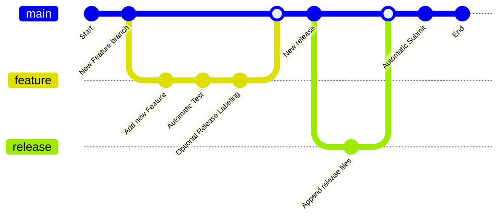

# Contributing to this Library

Hello! Contributions are essential to keep this library alive. I would like to keep it as easy as possible to contribute
changes. There are a few guidelines that I need contributors to follow so that all of us can benefit from quality control and
quality documentation.

## Getting Started

First, review and understand the following diagram:

# Continuous Delivery Process Automation


Continuous Delivery is the ability to get changes of all types—including new features, configuration changes, bug fixes and experiments—into production, or into the hands of users, safely and quickly in a sustainable way. The goal was to make this process as seamless as possible for the engineer releasing new features. The current approach relays on using Github Actions combined with GNU Make recipes to automate as much of the process as possible. This article explains different parts of our process and how Github Actions was setup to achieve what we needed to.

## GitHub Action Workflows

The Continuous Delivery Process relay on four GitHub Actions Workflows to achieve this goals:

<details>
  <summary>Run Unit Tests against source files included in a Pull Request targeting the main branch</summary>

```yml
name: Run Unit Tests against source files included in a Pull Request targeting the main branch
on:
  pull_request:
    branches:
      - main
jobs:
  test:
    runs-on: ubuntu-latest
    if: ${{ ! startsWith(github.head_ref, 'release') }}
    steps:
      - name: Checkout Library Repository
        uses: actions/checkout@v3
      - name: Identify changes in source files
        uses: dorny/paths-filter@v2
        id: changes
        with:
          filters: |
            src:
              - 'prolog/**'
              - 'prolog/**/*'
      - name: Run Unit Tests if change in source files is detected
        if: steps.changes.outputs.src == 'true'
        run: make test
      - name: ✅ Set the merge commit status check using GitHub REST API
        # see https://docs.github.com/en/rest/reference/repos#create-a-commit-status
        if: ${{ success() }}
        run: |
          curl --request POST \
          --url https://api.github.com/repos/${{ github.repository }}/statuses/${{ github.sha }} \
          --header 'authorization: Bearer ${{ secrets.GITHUB_TOKEN }}' \
          --header 'content-type: application/json' \
          --data '{
            "context": "Staging Tests",
            "state": "success",
            "description": "Staging tests passed",
            "target_url": "https://github.com/${{ github.repository }}/actions/runs/${{ github.run_id }}"
          }'
```
</details>

<details>
  <summary>Create a new Version with Pull Request targeting the release branch</summary>

```yml
name: Create a new Version with Pull Request targeting the release branch

on:
  pull_request:
    types: [ closed ]
    branches:
      - main
jobs:
  bump_version:
    name: Create a new Version with Pull Request targeting the release branch
    if: ${{ (github.event.pull_request.merged == true) && (contains(github.event.pull_request.labels.*.name, 'release')) && ! startsWith(github.head_ref, 'release') }}
    runs-on: ubuntu-latest
    steps:
      - name: Checkout Library Repository
        uses: actions/checkout@v3
      - name: Increase version counter and update version dependent files
        run: make bump
      - name: Set the VERSION variable int he GitHub Environment
        run: echo "VERSION=$(awk -F=' ' '/current_version/{printf "v%s",$2}' .bumpversion.cfg)" >> $GITHUB_ENV
      - name: Create Pull Request
        id: cpr
        uses: peter-evans/create-pull-request@v4
        with:
          token: ${{ secrets.PAT }}
          branch: release
          title: "Release: ${{ env.VERSION }} - ${{ github.event.pull_request.title }}"
          delete-branch: true
      - name: Check outputs
        if: ${{ steps.cpr.outputs.pull-request-number }}
        run: |
          echo "Pull Request Number - ${{ steps.cpr.outputs.pull-request-number }}"
          echo "Pull Request URL - ${{ steps.cpr.outputs.pull-request-url }}"
      - name: Enable pull request automerge
        uses: peter-evans/enable-pull-request-automerge@v2
        with:
          token: ${{ secrets.PAT }}
          pull-request-number: ${{ steps.cpr.outputs.pull-request-number }}
```
</details>

<details>
  <summary>Create a new release based on current version</summary>

```yml
name: Create a new release based on current version
on:
  pull_request:
    types: [ closed ]
    branches:
      - main
jobs:
  release:
    name: Create a new release based on current version
    if: github.event.pull_request.merged == true && startsWith(github.head_ref, 'release')
    runs-on: ubuntu-latest
    steps:
    - name: Checkout Library Repository
      uses: actions/checkout@v3
    - name: Create a new release based on current version
      env:
        GITHUB_TOKEN: ${{ secrets.PAT }}
      run: make release-if-new-version

```
</details>

<details>
  <summary>Status</summary>

```yml
name: Status
on:
  push:
    tags:
      - 'v*'
jobs:
  ship:
    name: Ship the new released package into the Library Supply Chain Infrastructure
    runs-on: ubuntu-latest
    steps:
    - name: Checkout Library Repository
      uses: actions/checkout@v3
    - name: Ship the new released package into the Library Supply Chain Infrastructure
      run: make install

```
</details>


## Continuous Testing

Continuous testing is the process of executing automated tests as part of the software delivery pipeline to obtain immediate feedback on the business risks associated with a software release candidate. The goal of continuous testing is to provide fast and continuous feedback regarding the level of business risk in the latest build or release candidate. This information can then be used to determine if the software is ready to progress through the delivery pipeline at any given time.

The current approach is as follows:
- Restrict direct commits to the main branch
- Restrict commit push to only Pull Request
- Restrict Pull Request merges based on successful execution of checks

### Branch protection rule

To restrict the main branch we included a [branch protection rule](https://github.com/crgz/abbreviated_dates/settings/branch_protection_rules/29590588
) to ensure our workflows pass status checks for all pull requests merged into the main branch. The `Do not allow bypassing the above settings` needs to be in place to allow the test from the local environment:


With this settings any attemp to push will be rejected:

``` bash
 ! [remote rejected] main -> main (protected branch hook declined)
error: failed to push some refs to 'github.com:crgz/abbreviated_dates.git'
```

###  GitHub Action

We can leverage on a GitHub Action Workflows on push and restrict the main branch. We can use GitHub Actions to automatically test our code when a pull request is opened and require that all checks pass before it can be merged. Since the main branch cannot be pushed to directly, it wouldn't be possible to avoid the CI job.

The GitHub Action for Checking the code has been writen in the file: `.github/workflows/test.yml`

The content of the file is as follows:

```yaml
name: test
on:
  push:
    branches:
      - main
jobs:
  test:
    runs-on: ubuntu-latest
    steps:
      - name: checkout repo
        uses: actions/checkout@v2
      - name: test
        run: make test
      - name: Staging Tests ✅
        if: ${{ success() }}
        # set the merge commit status check
        # using GitHub REST API
        # see https://docs.github.com/en/rest/reference/repos#create-a-commit-status
        run: |
          curl --request POST \
          --url https://api.github.com/repos/${{ github.repository }}/statuses/${{ github.sha }} \
          --header 'authorization: Bearer ${{ secrets.GITHUB_TOKEN }}' \
          --header 'content-type: application/json' \
          --data '{
            "context": "Staging Tests",
            "state": "success",
            "description": "Staging tests passed",
            "target_url": "https://github.com/${{ github.repository }}/actions/runs/${{ github.run_id }}"
          }'
```

## Managing the automatic deletion of branches

You can have head branches automatically deleted after pull requests are merged in your repository.

1. On GitHub.com, navigate to the main page of the repository.
1. Under your repository name, click  Settings.
   Repository settings button
1. Under "Pull Requests", select or unselect **Automatically delete head branches**.
   Checkbox to enable or disable automatic deletion of branches

