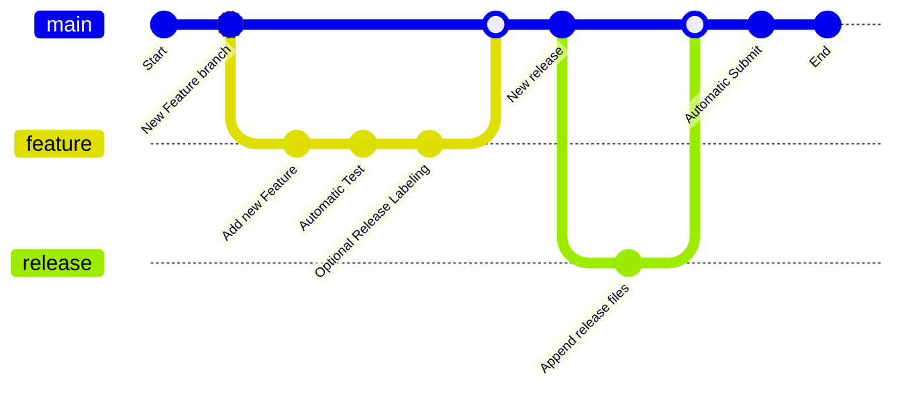

# Contributing Guidelines
> for Repositories Driven by GitHub Actions

First off, thanks for taking the time to contribute! ❤️

Contributions are essential to keep our projects alive. I would like to
keep it as easy as possible to contribute changes. There are a few
guidelines that I need contributors to follow so that all of us can
benefit from quality control and quality documentation. All types of
contributions are encouraged and valued. Please make sure to read the
relevant section before making your contribution. It will make it a lot
easier for us maintainers and smooth out the experience for all
involved. The community looks forward to your contributions. 🎉

And if you like the project, but just don’t have time to contribute,
that’s fine. There are other easy ways to support the project and show
your appreciation, which we would also be very happy about:

-   Star the project
-   Tweet about it
-   Refer this project in your project’s readme
-   Mention the project at local meetups and tell your
    friends/colleagues

I Have a Question
-----------------

If you want to ask a question, we assume that you have read the
available [Documentation](https://github.com/crgz/abbreviated_dates).

Before you ask a question, it is best to search for existing
[Issues](https://github.com/crgz/abbreviated_dates/issues) that might
help you. In case you have found a suitable issue and still need
clarification, you can write your question in this issue. It is also
advisable to search the internet for answers first.

If you then still feel the need to ask a question and need
clarification, we recommend the following:

-   Open an
    [Issue](https://github.com/crgz/abbreviated_dates/issues/new).
-   Provide as much context as you can about what you’re running into.
-   Provide project and platform versions, depending on what seems
    relevant.

We will then take care of the issue as soon as possible.

I Want To Contribute
--------------------

### Reporting Bugs

#### Before Submitting a Bug Report

A good bug report shouldn’t leave others needing to chase you up for
more information. Therefore, we ask you to investigate carefully,
collect information and describe the issue in detail in your report.
Please complete the following steps in advance to help us fix any
potential bug as fast as possible.

-   Make sure that you are using the latest version.
-   Determine if your bug is really a bug and not an error on your side
    e.g. using incompatible environment components/versions (Make sure
    that you have read the
    [documentation](https://github.com/crgz/abbreviated_dates). If you
    are looking for support, you might want to check the previous
    section).
-   To see if other users have experienced (and potentially already
    solved) the same issue you are having, check if there is not already
    a bug report existing for your bug or error in the [bug 
tracker](https://github.com/crgz/abbreviated_dates/issues?q=label%3Abug).
-   Also make sure to search the internet (including Stack Overflow) to
    see if users outside the GitHub community have discussed the
    issue.
-   Collect information about the bug:

  -   Stack trace
  -   OS, Platform and Version
  -   Version of the SWI-Prolog interpreter.
  -   Possibly your input and the output
  -   Can you reliably reproduce the issue? And can you also reproduce
      it with older versions?

#### How Do I Submit a Good Bug Report?

You must never report security related issues, vulnerabilities or bugs
including sensitive information to the issue tracker, or elsewhere in
public. Instead, sensitive bugs must be sent by email to the project
coordinators

We use GitHub issues to track bugs and errors. If you run into an issue
with the project:

-   Open an [Issue](https://github.com/crgz/abbreviated_dates/issues/new).
    (Since we can’t be sure at this point whether it is a bug or not, we
    ask you not to talk about a bug yet and not to label the issue.)
-   Explain the behavior you would expect and the actual behavior.
-   Please provide as much context as possible and describe the
    *reproduction steps* that someone else can follow to recreate the
    issue on their own. This usually includes your code. For good bug
    reports you should isolate the problem and create a reduced test
    case.
-   Provide the information you collected in the previous section.

Once it’s filed:

-   The project team will label the issue accordingly.
-   A team member will try to reproduce the issue with your provided
    steps. If there are no reproduction steps or no obvious way to
    reproduce the issue, the team will ask you for those steps and mark
    the issue as *needs-details*. Bugs with the *needs-details* tag
    will not be addressed until they are reproduced.
-   If the team is able to reproduce the issue, it will be marked
    *needs-fix*, as well as possibly other tags (such as *critical*), and the issue will be left to be [implemented by
    someone](https://github.com/crgz/abbreviated_dates/#your-first-code-contribution).

### Suggesting Enhancements

This section guides you through submitting an enhancement suggestion for
Abbreviated Date Parser, **including completely new features and minor
improvements to existing functionality**. Following these guidelines
will help maintainers and the community to understand your suggestion
and find related suggestions.

#### Before Submitting an Enhancement

-   Make sure that you are using the latest version.
-   Read the [documentation](https://github.com/crgz/abbreviated_dates)
    carefully and find out if the functionality is already covered,
    maybe by an individual configuration.
-   Perform a [search](https://github.com/crgz/abbreviated_dates/issues)
    to see if the enhancement has already been suggested. If it has, add
    a comment to the existing issue instead of opening a new one.
-   Find out whether your idea fits with the scope and aims of the
    project. It’s up to you to make a strong case to convince the
    project’s developers of the merits of this feature. Keep in mind
    that we want features that will be useful to the majority of our
    users and not just a small subset. If you’re just targeting a
    minority of users, consider writing an add-on/plugin library.

#### How Do I Submit a Good Enhancement Suggestion?

Enhancement suggestions are tracked as [GitHub
issues](https://github.com/crgz/abbreviated_dates/issues).

-   Use a **clear and descriptive title** for the issue to identify the
    suggestion.
-   Provide a **step-by-step description of the suggested enhancement**
    in as many details as possible.
-   **Describe the current behavior** and **explain which behavior you
    expected to see instead** and why. At this point you can also tell
    which alternatives do not work for you.
-   You may want to **include screenshots and animated GIFs** which help
    you demonstrate the steps or point out the part which the suggestion
    is related to. You can use [this
    tool](https://www.cockos.com/licecap/) to record GIFs on macOS and
    Windows, and
    [this](https://github.com/colinkeenan/silentcast)[tool](https://linuxhint.com/install-peek-animated-gif-recorder-linux/)
    on Linux.
-   **Explain why this enhancement would be useful** to most Abbreviated
    Date Parser users. You may also want to point out the other projects
    that solved it better and which could serve as inspiration.

Typical Contribution Workflow
-----------------------------

### Fetch the latest changes

Please feel free to use your favorite environment. For command line
users there is a GNU Make shortcut recipe to switch back to the main
branch, fetch changes and delete previously merged branches:

```commandline
make reset
```

### Create a Pull Request

As usual:

1.  Create your new feature branch
2.  Push it to GitHub
3.  Create your Pull Request

Please ensure that the Pull Request has:

-   A good description
-   Unit Tests covering the new source code
-   The source code conform to Coding guidelines for Prolog

### Wait for the Test to Finish

The Test GitHub Action Workflow will be triggered once the Pull Request
is Created and after each new commit is pushed to the Pull Request. We
might request for additional changes to ensure it pass our quality
checks and send it back to you with further comments if the tests fail
or if the Pull Request does not meet the validation criteria.

Optionally label the Pull Request as release ready

If the Pull Request is implementing a feature intended to be used by our
final users it should be labeled with the release label. If the Pull
Request is implementing improvements to the operational aspects of our
work it can be merged without delivering a new release. This is to
ensure that we only release new packages implementing end user features
into the Library Supply Chain Infrastructure.

Review

-   For Valid Pull Request, the reviewer (person familiar with the
    code/functionality) checks if the Pull Request looks good or needs
    additional changes.
-   If all looks good, the reviewer would approve the Pull Request.
-   If a change is needed, the contributor is requested to make a
    suggested change.
-   You make the change and submit for the review again.
-   This cycle repeats itself till the Pull Request gets approved.
-   We might request you to make further changes to your Pull Request
    for the tests to pass.
-   All the code will be merged in the code base as soon as the review
    is approved.

Delivery

A set of GitHub Action Workflows intended to deliver the new release
will be triggered if it has the release label as soon as the Pull
Request is closed.

General guidelines and philosophy for contribution

-   Please include unit tests when you contribute new features, as they
    help to a) prove that your code works correctly, and b) guard
    against future breaking changes to lower the maintenance cost.
-   Bug fixes also generally require unit tests, because the presence of
    bugs usually indicates insufficient test coverage.
-   Tests should follow the testing best practices guide.

Coding style

Changes to the project Prolog code should conform to Coding guidelines
for Prolog

Running unit tests

There are two ways to run unit tests.

1.  Using tools and libraries installed directly on your system with:

    The system should install the required packages to enable this
    operation

2.  Using GitHub Actions test Workflow. This happens automatically as
    part of the test GitHub Action Workflow.

## Join The Project

Team We are happy to have you in our team as soon as we know you want to be part of it. You will receive an email inviting
you to the organization. You will need to accept the invitation before becoming a member of our team.