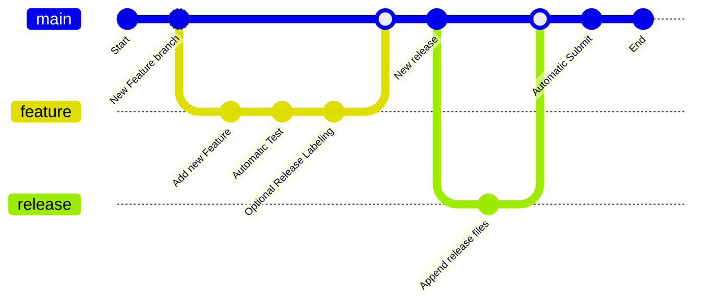

# Contributing to this Library

Hello! Contributions are essential to keep this library alive. I would like to keep it as easy as possible to contribute
changes. There are a few guidelines that I need contributors to follow so that all of us can benefit from quality control and
quality documentation.

## Getting Started

First, review and understand the following diagram:



## Typical Contribution Workflow

### Fetch the latest changes

Please feel free to use your favourite environment. For command line users there is a GNU Make shortcut recipe to switch back
to the main branch, fetch changes and delete previously merged branches:

```commandline
make reset
```

### Create a Pull Request

Aas usual:
1. Create your new feature branch
2. Push it to GitHub
3. Create your Pull Request

Please ensure that the Pull Request has:
- A good description
- Unit Tests covering the new source code
- The source code conform to [Coding guidelines for
  Prolog](chrome-extension://hmigninkgibhdckiaphhmbgcghochdjc/pdfjs/web/viewer.html?file=https%3A%2F%2Fwww.covingtoninnovations.com%2Fmc%2Fplcoding.pdf)

### Wait for the Test to Finish

The Test GitHub Action Workflow will be triggered once the Pull Request is Created and after each new commit is pushed to the
Pull Request. We might request for additional changes to ensure it pass our quality checks and send it back to you with
further comments if the tests fail or if the Pull Request does not meet the validation criteria.

### Optionally label the Pull Request as `release` ready

If the Pull Request is implementing a feature intended to be used by our final users it should be labeled with the `release`
label. If the Pull Request is implementing improvements to the operational aspects of our work it can be merged without
delivering a new release. This is to ensure that we only release new packages implementing end user features into the
Library Supply Chain Infrastructure.

### Review

- For Valid Pull Request, the reviewer (person familiar with the code/functionality) checks if the Pull Request looks good or
  needs additional changes.
- If all looks good, the reviewer would approve the Pull Request.
- If a change is needed, the contributor is requested to make a suggested change.
- You make the change and submit for the review again.
- This cycle repeats itself till the Pull Request gets approved.
- We might request you to make further changes to your Pull Request for the tests to pass. 
- All the code will be merged in the code base as soon as the review is approved.

### Delivery

A set of GitHub Action Workflows intended to deliver the new release will be triggered if it has the `release` label as soon
as the Pull Request is closed.

## General guidelines and philosophy for contribution

*  Include unit tests when you contribute new features, as they help to a) prove that your code works correctly, and b) guard
   against future breaking changes to lower the maintenance cost.
*  Bug fixes also generally require unit tests, because the presence of bugs usually indicates insufficient test coverage.
*  Tests should follow the [testing best practices](https://www.swi-prolog.org/pldoc/man?section=unitbox) guide.

## Coding style

Changes to the project Prolog code should conform to [Coding guidelines for
Prolog](chrome-extension://hmigninkgibhdckiaphhmbgcghochdjc/pdfjs/web/viewer.html?file=https%3A%2F%2Fwww.covingtoninnovations.com%2Fmc%2Fplcoding.pdf)

## Running unit tests

There are two ways to run unit tests.

1.  Using tools and libraries installed directly on your system with:

 ```bash
make test
 ```
The system should install the required packages to enable this operation

2.  Using GitHub Actions test Workflow. This happens automatically as part of the test GitHub Action Workflow. 
