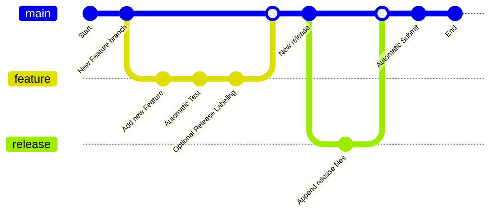

# Contributing to this Library

Hello! Contributions are essential to keep this library alive. I would like to keep it as easy as possible to contribute
changes. There are a few guidelines that I need contributors to follow so that all of us can benefit from quality control and
quality documentation.

## Getting Started

First, review and understand the following diagram:



## Typical Pull Request Workflow -

**1. New PR** - As a contributor, you submit a New PR on GitHub. At this stage we check if the PR is valid and meets certain
quality requirements. Please check if the PR has sufficient description, if applicable unit tests are added, if it is a
reasonable contribution meaning it is not a single liner cosmetic PR.

**2. Test** - We can't move forward if the tests fail. - If the PR didn't meet the validation criteria, we request for
additional changes to be made to PR to pass quality checks and send it back or on rare occasions we may reject it.

**3. Review** - If the PR passes all the quality checks then we go ahead and assign a reviewer.  - For Valid PR, the reviewer
(person familiar with the code/functionality) checks if the PR looks good or needs additional changes. - If all looks good,
the reviewer would approve the PR. - If a change is needed, the contributor is requested to make a suggested change. - You
make the change and submit for the review again. - This cycle repeats itself till the PR gets approved.

**4. Approved** - Once the PR is approved, it gets `release` label applied, and it initiates the automated release.  - In
such situations, we may request you to make further changes to your PR for the tests to pass. - Once the tests pass, we now
bring all the code in the internal code base.

**5. Submit** - Once the PR is merged in the main branch an automated process submit the release to the SwiProlog Pack
Repository

## General guidelines and philosophy for contribution

*   Include unit tests when you contribute new features, as they help to a) prove that your code works correctly, and b)
    guard against future breaking changes to lower the maintenance cost.
*   Bug fixes also generally require unit tests, because the presence of bugs usually indicates insufficient test coverage.
*  Tests should follow the [testing best practices](https://www.swi-prolog.org/pldoc/man?section=unitbox) guide.

## Coding style

Changes to the project Prolog code should conform to [Coding guidelines for
Prolog](chrome-extension://hmigninkgibhdckiaphhmbgcghochdjc/pdfjs/web/viewer.html?file=https%3A%2F%2Fwww.covingtoninnovations.com%2Fmc%2Fplcoding.pdf)

## Running unit tests

There are two ways to run TensorFlow unit tests.

1.  Using tools and libraries installed directly on your system with:

 ```bash
make test
 ```
The system should install the required packages to enable this operation

2.  Using GitHub Actions test Workflow. This happens automatically as part of the test GitHub Action Workflow. 
